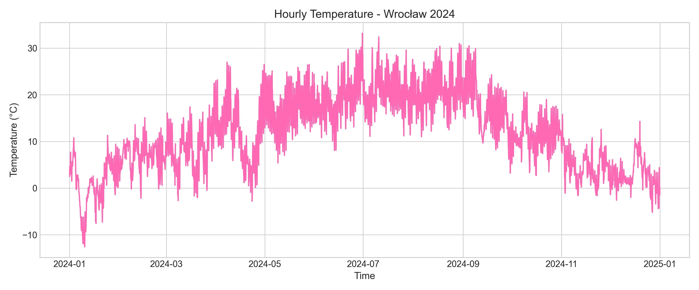
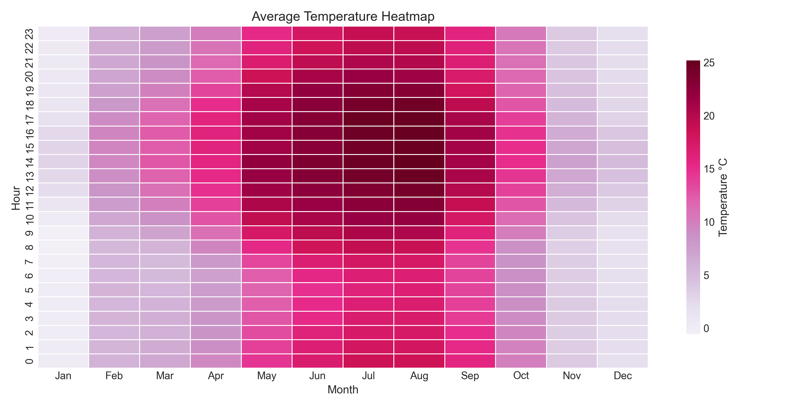
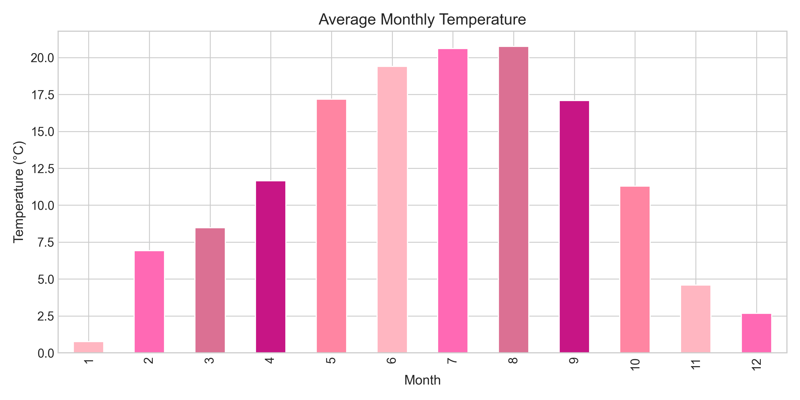

# Weather Wrocław ETL

Python ETL project for analyzing historical weather data from Wrocław using the Open-Meteo API.

The project extracts hourly weather data, transforms it into a structured dataset, performs statistical analysis, generates visualizations, and exports reports in JSON and PDF formats.

---

## Visualizations

The project generates the following data visualizations:

### Hourly Temperature


### Temperature heatmap


### Average Monthly Temperature


## Features

- Weather data extraction from the Open-Meteo API
- End-to-end ETL pipeline implementation
- Data transformation and preprocessing with pandas
- Statistical analysis of historical weather data
- Data visualization with matplotlib and seaborn
- Automated report generation (JSON, PDF)
- Logging and exception handling

---

## Tech Stack

- Python
- pandas
- matplotlib
- seaborn
- requests
- reportlab

---

## Project Structure

The project architecture:

```bash
weather-wroclaw/
│
├── analysis/
│   ├── export.py
│   ├── export_pdf.py
│   ├── plots.py
│   └── stats.py
│
├── scripts/
│   ├── extract.py
│   ├── transform.py
│   └── load.py
│
├── data/                  # raw and processed CSV datasets (ignored in git)
├── output/                # generated final reports (JSON, PDF)
├── plots/                # generated visualization (PNG charts)
│
├── config.py             # configuration (API, paths, settings)
├── main.py               # pipeline entry point
├── requirements.txt
└── README.md
```

---

## Installation

Clone the repository:

```bash
git clone https://github.com/BaranIga/weather-wroclaw.git
cd weather-wroclaw
```

Install dependencies:

```bash
pip install -r requirements.txt
```

---

### Configuration

All configuration is stored in config.py.

You can modify:
- LATITUDE / LONGITUDE – location (default: Wrocław)
- START_DATE / END_DATE – time range
- output file paths (data/, output/, plots/)
- visualization settings

> The project uses the Open-Meteo API, which does not require an API key.

---

## Usage

### Run the ETL pipeline

```bash
python main.py
```

### Pipeline Overview

The pipeline performs the following steps:
- fetch hourly weather data from Open-Meteo API
- save raw data to data/
- transform and clean dataset
- perform statistical analysis
- generate visualizations (plots/)
- export results:
  - output/summary.json
  - output/report.pdf

### Notes

- All output directories are created automatically if they do not exist
- First run may take a few seconds due to API requests
- No API key is required (Open-Meteo is free to use)

---

## Architecture

The project follows an ETL pipeline architecture for processing historical weather data.

API → Extract → Transform → Analysis → Visualization → Export (JSON, PDF, PNG)

## Example Outputs

Generated files:
- `data/wroclaw_weather.csv` – raw dataset
- `output/summary.json` – statistical summary
- `output/report.pdf` – formatted PDF report
- `plots/` – generated charts (PNG)

---

## Key Findings (Example Results)

- Average temperature: 11.79°C
- Hottest day: 33.20°C (2024-06-30)
- Coldest day: -12.60°C (2024-01-09)
- Wettest month: September 
- Rainy hours: 1379 hours total

---

## Future Improvements

- CLI arguments support
- Multi-city comparison
- Automated tests (pytest)
- Database integration
- Docker containerization

## Author

Created by Iga Baran